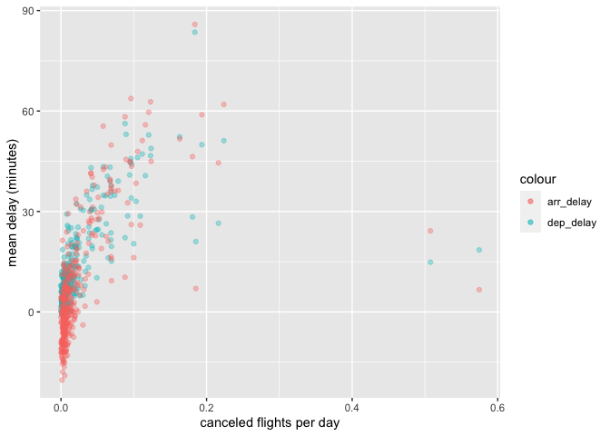

HW2
================
Georgia Warren
9/25/2021

Link to github: <https://github.com/gewarrren/gewarrren.git>

# Question 1

How many flights have a missing `dep_time`? What other variables are
missing? What might these rows represent?

``` r
library(nycflights13)
library(dplyr)
```

    ## 
    ## Attaching package: 'dplyr'

    ## The following objects are masked from 'package:stats':
    ## 
    ##     filter, lag

    ## The following objects are masked from 'package:base':
    ## 
    ##     intersect, setdiff, setequal, union

``` r
library(ggplot2)
library(lubridate)
```

    ## 
    ## Attaching package: 'lubridate'

    ## The following objects are masked from 'package:base':
    ## 
    ##     date, intersect, setdiff, union

``` r
# Counting flights by missing `dep_time`
flights %>% 
  filter(is.na(dep_time)) %>% 
  summarise(mising_dep_time = n())
```

    ## # A tibble: 1 × 1
    ##   mising_dep_time
    ##             <int>
    ## 1            8255

``` r
# Checking which variables contain NAs
summary(flights)  
```

    ##       year          month             day           dep_time    sched_dep_time
    ##  Min.   :2013   Min.   : 1.000   Min.   : 1.00   Min.   :   1   Min.   : 106  
    ##  1st Qu.:2013   1st Qu.: 4.000   1st Qu.: 8.00   1st Qu.: 907   1st Qu.: 906  
    ##  Median :2013   Median : 7.000   Median :16.00   Median :1401   Median :1359  
    ##  Mean   :2013   Mean   : 6.549   Mean   :15.71   Mean   :1349   Mean   :1344  
    ##  3rd Qu.:2013   3rd Qu.:10.000   3rd Qu.:23.00   3rd Qu.:1744   3rd Qu.:1729  
    ##  Max.   :2013   Max.   :12.000   Max.   :31.00   Max.   :2400   Max.   :2359  
    ##                                                  NA's   :8255                 
    ##    dep_delay          arr_time    sched_arr_time   arr_delay       
    ##  Min.   : -43.00   Min.   :   1   Min.   :   1   Min.   : -86.000  
    ##  1st Qu.:  -5.00   1st Qu.:1104   1st Qu.:1124   1st Qu.: -17.000  
    ##  Median :  -2.00   Median :1535   Median :1556   Median :  -5.000  
    ##  Mean   :  12.64   Mean   :1502   Mean   :1536   Mean   :   6.895  
    ##  3rd Qu.:  11.00   3rd Qu.:1940   3rd Qu.:1945   3rd Qu.:  14.000  
    ##  Max.   :1301.00   Max.   :2400   Max.   :2359   Max.   :1272.000  
    ##  NA's   :8255      NA's   :8713                  NA's   :9430      
    ##    carrier              flight       tailnum             origin         
    ##  Length:336776      Min.   :   1   Length:336776      Length:336776     
    ##  Class :character   1st Qu.: 553   Class :character   Class :character  
    ##  Mode  :character   Median :1496   Mode  :character   Mode  :character  
    ##                     Mean   :1972                                        
    ##                     3rd Qu.:3465                                        
    ##                     Max.   :8500                                        
    ##                                                                         
    ##      dest              air_time        distance         hour      
    ##  Length:336776      Min.   : 20.0   Min.   :  17   Min.   : 1.00  
    ##  Class :character   1st Qu.: 82.0   1st Qu.: 502   1st Qu.: 9.00  
    ##  Mode  :character   Median :129.0   Median : 872   Median :13.00  
    ##                     Mean   :150.7   Mean   :1040   Mean   :13.18  
    ##                     3rd Qu.:192.0   3rd Qu.:1389   3rd Qu.:17.00  
    ##                     Max.   :695.0   Max.   :4983   Max.   :23.00  
    ##                     NA's   :9430                                  
    ##      minute        time_hour                  
    ##  Min.   : 0.00   Min.   :2013-01-01 05:00:00  
    ##  1st Qu.: 8.00   1st Qu.:2013-04-04 13:00:00  
    ##  Median :29.00   Median :2013-07-03 10:00:00  
    ##  Mean   :26.23   Mean   :2013-07-03 05:22:54  
    ##  3rd Qu.:44.00   3rd Qu.:2013-10-01 07:00:00  
    ##  Max.   :59.00   Max.   :2013-12-31 23:00:00  
    ## 

``` r
# Flights by missing `dep_time` in which other variables are also missing
flights %>% 
  filter(is.na(dep_time)) %>%
  select(dep_time, dep_delay, arr_time, arr_delay, air_time)
```

    ## # A tibble: 8,255 × 5
    ##    dep_time dep_delay arr_time arr_delay air_time
    ##       <int>     <dbl>    <int>     <dbl>    <dbl>
    ##  1       NA        NA       NA        NA       NA
    ##  2       NA        NA       NA        NA       NA
    ##  3       NA        NA       NA        NA       NA
    ##  4       NA        NA       NA        NA       NA
    ##  5       NA        NA       NA        NA       NA
    ##  6       NA        NA       NA        NA       NA
    ##  7       NA        NA       NA        NA       NA
    ##  8       NA        NA       NA        NA       NA
    ##  9       NA        NA       NA        NA       NA
    ## 10       NA        NA       NA        NA       NA
    ## # … with 8,245 more rows

These rows might represent flights that have been canceled.

# Question 2

Currently `dep_time` and `sched_dep_time` are convenient to look at, but
hard to compute with because they’re not really continuous numbers.
Convert them to a more convenient representation of number of minutes
since midnight.

``` r
flights %>% 
  mutate(dep_time_min = (dep_time %/% 100) * 60 + (dep_time %% 100),
         sched_dep_time_min = (sched_dep_time %/% 100) * 60 + (sched_dep_time %% 100)) %>% 
  select(dep_time_min, sched_dep_time_min)
```

    ## # A tibble: 336,776 × 2
    ##    dep_time_min sched_dep_time_min
    ##           <dbl>              <dbl>
    ##  1          317                315
    ##  2          333                329
    ##  3          342                340
    ##  4          344                345
    ##  5          354                360
    ##  6          354                358
    ##  7          355                360
    ##  8          357                360
    ##  9          357                360
    ## 10          358                360
    ## # … with 336,766 more rows

# Question 3

Look at the number of canceled flights per day. Is there a pattern? Is
the proportion of canceled flights related to the average delay? Use
multiple dyplr operations, all on one line, concluding with
`ggplot(aes(x= ,y=)) + geom_point()`.

``` r
flights %>%
  mutate(dep_day = make_datetime(year, month, day))  %>%
  group_by(dep_day) %>%
  summarise(canceled = sum(is.na(dep_delay)), 
            count = n(),
            mean_dep_delay = mean(dep_delay, na.rm=TRUE),
            mean_arr_delay = mean(arr_delay, na.rm=TRUE)) %>%
  ggplot(aes(x = canceled/count)) +
           geom_point(aes(y=mean_dep_delay, color = "dep_delay"), alpha =0.35) + 
           geom_point(aes(y=mean_arr_delay, color = "arr_delay"), alpha =0.35) +
           xlab('canceled flights per day') +
           ylab('mean delay (minutes)')
```

<!-- -->

Most of the canceled flights remain around 0 for a range of delay times,
besides a few exceptions.
